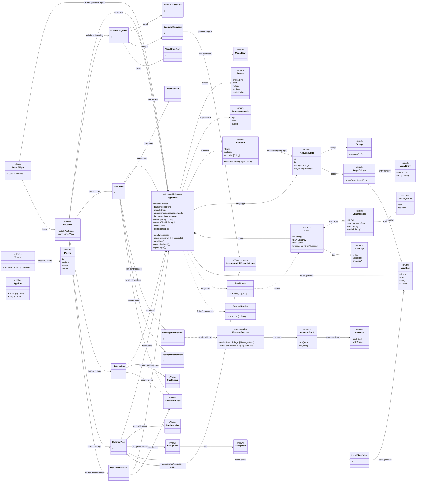
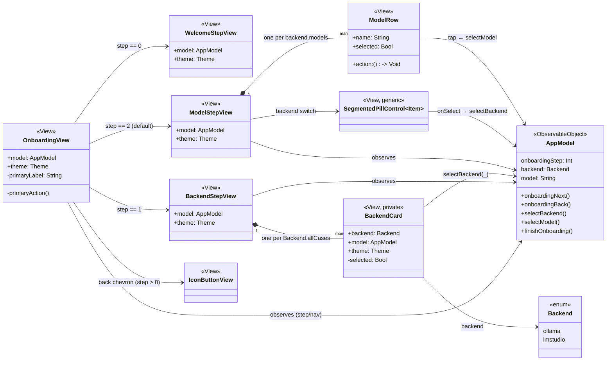
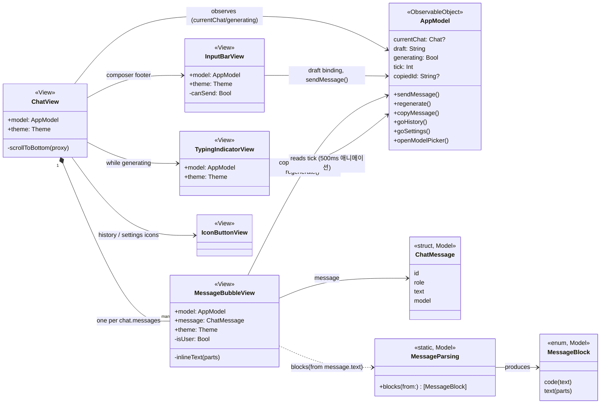
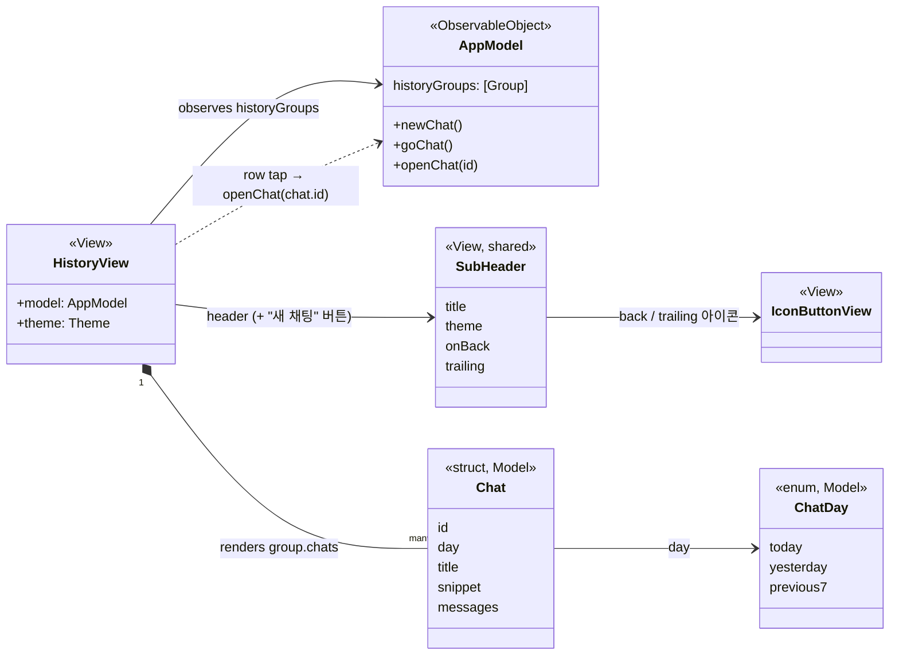
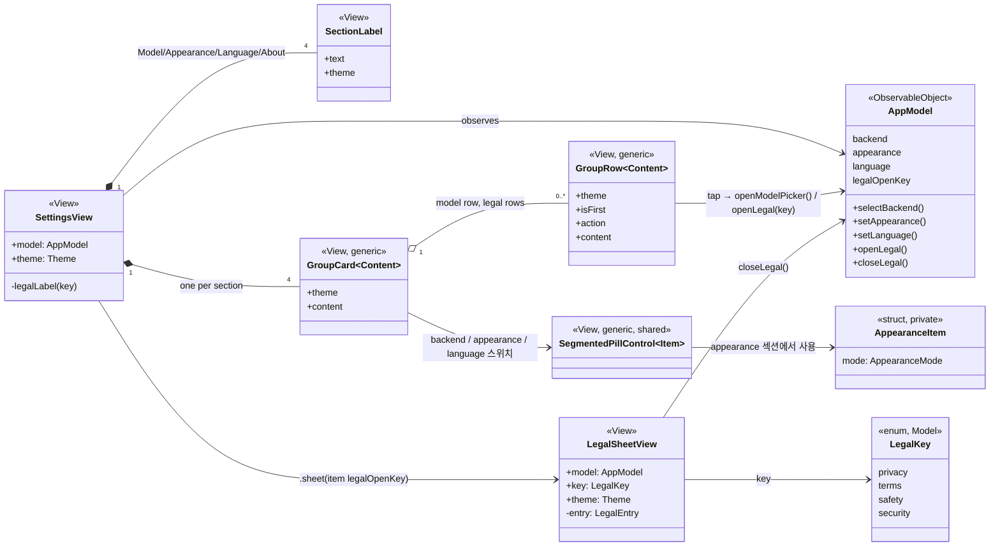
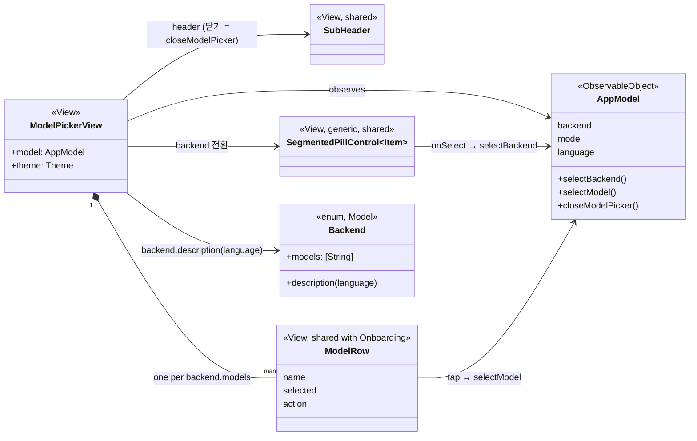
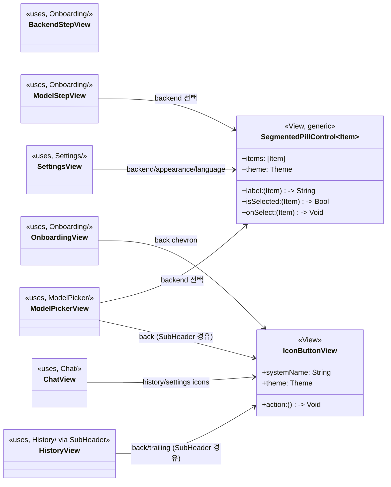

# LocalAI UML 클래스 다이어그램

전체 소스는 `App → Model → Theme → Views` 순으로 좌에서 우로 의존한다: 진입점이 `AppModel` 하나를 만들고, 모든 화면(View)이 그 `AppModel`을 관찰(`@ObservedObject`)해서 상태를 읽고 액션을 호출한다. 실제 네트워크 계층은 없고 `CannedReplies`가 응답을 흉내 낸다.

## 요약

- **App / Root**: `LocalAIApp`이 `AppModel` 하나를 만들고, `RootView`가 `AppModel.screen` 값에 따라 5개 화면 중 하나를 스위칭.
- **Model**: `AppModel`이 유일한 `ObservableObject`로 모든 화면의 상태·액션을 소유. `Chat`/`ChatMessage`는 대화 데이터, `Backend`/`AppLanguage`는 설정값, `MessageParsing`은 마크다운 라이트 렌더러.
- **Theme**: `Palette`(원색 토큰) → `Theme`(다크/라이트 해석) → View들이 소비.
- **Views**: 화면별 폴더(Onboarding/Chat/History/Settings/ModelPicker)가 각각 `AppModel`을 관찰하며, `Components`(SegmentedPillControl, IconButtonView)는 여러 화면에서 공유.

---

# 폴더별 상세 다이어그램

각 `Views/` 하위 폴더 내부에서 타입들이 어떻게 조립되는지 좌→우로 펼친 상세 다이어그램. 모든 하위 View는 부모로부터 `theme: Theme`를 값으로 전달받고, `AppModel`은 `@ObservedObject`로 직접 관찰한다 (전달이 아니라 참조 공유).

## Onboarding/

`OnboardingView`가 `onboardingStep`(0~2)에 따라 세 스텝 뷰 중 하나를 보여주고, 하단 진행 도트 + 기본 버튼(다음/시작하기)을 공통으로 그린다.

## Chat/

`ChatView`가 헤더(히스토리/설정 진입 + 모델 배지) · 메시지 스크롤 · 입력창을 세로로 쌓는다. 메시지 배지는 `MessageBubbleView`가 `MessageParsing`으로 코드/볼드 블록을 파싱해 그린다.

## History/

`HistoryView`는 공용 `SubHeader`를 얹고, `AppModel.historyGroups`(오늘/어제/지난 7일)를 순회하며 채팅 카드 목록을 그린다.

## Settings/

`SettingsView`가 섹션(Model/Appearance/Language/About)마다 `SectionLabel` + `GroupCard`(내부에 `GroupRow` 또는 `SegmentedPillControl`)를 쌓고, About의 각 행이 `LegalSheetView`를 시트로 띄운다.

## ModelPicker/

`ModelPickerView`는 `SubHeader` + 백엔드 스위치(`SegmentedPillControl`) + 모델 목록(`ModelRow`, Onboarding과 타입 공유) + 완료 버튼으로 구성된 단일 파일 화면.

## Components/ (교차 화면 공유)

두 파일 모두 상태를 갖지 않는 순수 표현 View. `theme`와 콜백만 받아 여러 화면에서 재사용된다.

